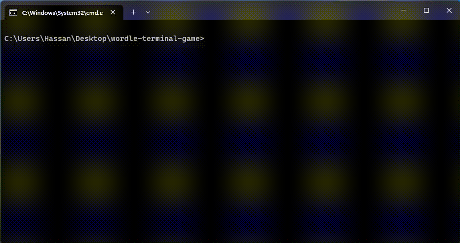

# Wordle Python Terminal Game

## Introduction
Wordle is a captivating word-guessing game designed to challenge your vocabulary and wordplay skills. This Python terminal-based game allows players to guess a five-letter word within six attempts. With a blend of strategy, deduction, and a touch of luck, Wordle offers an exciting and interactive gaming experience.



## How to Play
1. Run the Python script in your terminal.
2. A menu will be displayed, prompting you to enter a five-letter word.
3. Input your guess and press enter.
4. For each letter in your guess, the game will provide feedback:
   - Correct letter in the correct position: Displayed in **green**.
   - Correct letter in the wrong position: Displayed in **yellow**.
   - Incorrect letter: Displayed as is.
5. Keep guessing and receiving feedback until you guess the word correctly or exhaust all six attempts.
6. If you guess the word within the given attempts, a congratulatory message will be shown.
7. If you are unable to guess the word, the correct word will be revealed.
8. You can choose to play again by typing 'q' to exit.

## Requirements
- Python 3.x
- termcolor library (`pip install termcolor`)
- nltk library (`pip install nltk`)

## Installation
1. Clone the repository:
   ```
   git clone https://github.com/hassansim/wordle-terminal-game
   ```
2. Navigate to the project directory:
   ```
   cd wordle-game
   ```

## Usage
1. Run the Python script:
   ```
   python main.py
   ```
2. Enjoy playing Wordle in your terminal!

## Code
You can find the complete code for the Wordle game in the [main.py](main.py) file.

## License
This project is licensed under the MIT License. See the [LICENSE](LICENSE) file for more information.

## Conclusion
Wordle is an engaging word-guessing game that offers entertainment and a chance to sharpen your language skills. Challenge yourself, have fun, and improve your vocabulary with this delightful Python terminal game. Enjoy playing Wordle and may the words be in your favor!